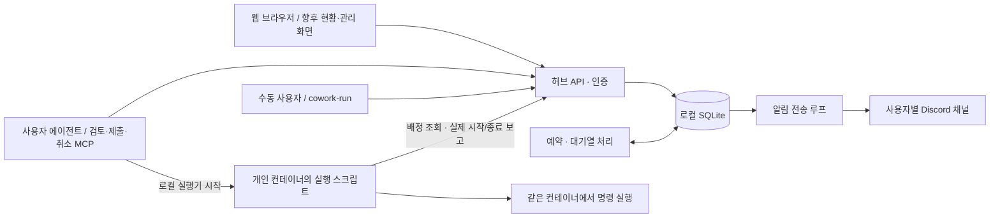

# cowork-hub

개인 Docker 컨테이너에서 작업하는 연구실을 위한 중앙 예약 서비스의 초기 구현이다.
사용자 측 실행 스크립트가 허브의 작업별 예약 허가를 기다렸다가 개인 컨테이너에서 명령을 실행하고 결과를 보고한다.
메인 컨테이너의 MCP가 현재 환경에서는 로컬 실행기를, 다른 환경에서는 사용자 SSH로 대상 실행기를 시작한다.
대상에 별도 에이전트나 MCP 설치는 필요 없다. 호스트 Docker 관리 권한은 필요 없다.
허브 컨테이너의 SSH 계정이나 Docker 소켓을 사용자에게 제공할 필요는 없다.

처음 사용하는 구성원은 [신규 사용자 매뉴얼](docs/first-user-guide.md)의 계정 준비·설치·등록·첫 실행 순서를 따른다.
소스와 설치 프로그램은 [GitHub 저장소](https://github.com/justezy0210/mcp-cowork-pgl)에서 제공한다.

현재는 **허브와 모의 Worker 검증, 네 서버와 사용자 `ezy`의 접근 권한 등록까지 완료**했다.
Docker 배포와 허브 정상 응답을 확인했고, stdio MCP와 현재 컨테이너의 Codex 등록을 추가했다.
개인 토큰으로 실제 `ezy` 권한의 서버·환경·작업·알림 설정 조회까지 확인했다. 사용자 측 `cowork-run`과 본인 작업용 허가·보고 API를 구현하고 임시 허브에서 실제 프로세스로 검증했다.
운영 허브 업데이트와 226 환경 승인을 완료했다. 실제 작업 두 건의 대기·자동 실행 전환·종료와
Discord 시작·종료 알림 4건의 전송을 확인했다. [226 운영 검증 기록](docs/verification-226.md)을 참고한다.
[로컬 실행 안내](docs/local-runner.md)에 현재 컨테이너 설정과 적용·실행 명령을 정리했다.
MCP에 로컬 작업 제출·취소와 자원 부족 시 대기·준비된 축소안·다른 서버 선택지를 추가했다.
226에서 실제 MCP 제출·취소·대기 전환·연결 종료 후 실행 유지·중복 요청 방지와 Discord 알림도 확인했다.
실행은 같은 실행기가 담당한다. 229의 SSH 환경 등록·관리자 승인과 실제 원격 실행 검증을 완료했다.
RTX 3090 장치 선택·CUDA 메모리 접근, GPU 대기·자동 전환, 연결 종료 후 실행 유지와 Discord 전송을 확인했다.
[229 운영 검증 기록](docs/verification-229.md)과 [SSH 실행 안내](docs/ssh-runner.md)를 참고한다.
[cowork-jobs 스킬](skills/cowork-jobs/SKILL.md)을 현재 사용자 Codex에 설치해 계산 작업에서 자동 선택하도록 설정했다.
[MCP 안내](docs/mcp-setup.md)를 참고한다. 224·228도 SSH 등록·메인 MCP 연결·관리자 승인을 완료했다.
새 MCP 연결에서 두 서버의 GPU 예약 사전검토를 확인했으며 실제 계산은 아직 제출하지 않았다.
실제 연구 작업 검증, 다른 사용자/클라이언트 설정·웹 플랫폼은 다음 단계다.

웹 등록 요청을 처리할 `cowork-connector`, 사용자별 추가 토큰 발급·폐기 API와 관리자 승인 대기 목록을
구현했다. [연결 프로그램 설치 안내](docs/connector-setup.md)에 설치·실행·허브 업데이트 절차를 정리했다.
2026-09-21 운영 허브 업데이트와 226 연결 프로그램 시작을 완료했고, 실제 229 SSH 등록 요청의 자동 처리를 확인했다.
Google 로그인 후 본인 토큰 발급·다운로드·목록·폐기 화면을 추가했다. [웹 토큰 설정](docs/web-tokens.md)을 따른다.
Firebase·HTTPS 운영 연결, 나머지 관리 화면, 버전별 GitHub Release 게시와 컨테이너 재시작 시 연결 프로그램 자동 실행 설정은 남아 있다.



## 현재 동작

아래는 기존 서버 단위 Worker API의 구현 상태다. 실제 Worker는 배포하지 않았다.
본인 환경·작업 전용 로컬 실행 API를 추가했다. 작업별 연결 상태와 실행 허가를 별도로 관리한다.
최신 실행 방향은 [현재 컨테이너 연결 안내](docs/worker-226-setup.md)를 따른다.

- 관리자·사용자·서버 Worker별 Bearer 인증과 사용자별 허용 서버 정책.
- 사용자가 SSH 접속 경로로 환경 등록 요청. 해당 서버 Worker의 검증 전에는 실행 불가.
- CPU 정수 단위, 메모리 MiB, 물리 GPU ID를 하나의 SQLite 트랜잭션에서 예약.
- GPU 한 장에 작업 하나. 모델·최소 VRAM 조건을 선택적으로 지정. 컨테이너가 달라도 같은 GPU ID를 중복 배정하지 않음.
- 접수 순서 중 실행 가능한 작업부터 배정. 후보 환경 순서대로 처음 들어맞는 서버 선택.
- `plan`은 상태를 변경하지 않으며, 축소 실행안의 **실제 argv**를 별도로 검토.
- `queue_if_unavailable`은 대기, `start_if_available`은 즉시 배정할 수 없으면 등록 없이 거절.
- 요청 키·Worker 이벤트의 중복 처리 방지, 실제 종료 보고 후 예약 반환과 다음 작업 배정.
- Worker가 45초 동안 응답하지 않으면 `UNKNOWN`. 기존 예약을 유지하며 재실행하지 않음.
- 영속 알림 대기 기록과 별도 Discord 전송 루프. 전송 실패가 계산 상태나 다음 배정을 막지 않음.

신청량 기준의 협력적 예약이다. 실제 CPU·메모리 사용량이나 GPU 접근을 강제 제한하지 않는다.
기존 컨테이너에서 허브를 거치지 않고 실행한 작업은 예약 원장에 포함되지 않는다.

## 사용자 계정 운영 규칙

[UID/GID 운영 규칙](plans/container-job-orchestration.md#uidgid-운영-규칙)을 확정했다.
사용자별 기준값 저장, UID 중복 거절, 환경 검증·배정 시 UID/GID 대조를 코드에 구현했다.
운영 허브에 배포했고 ezy의 기준값 `1101:1100`을 확인했다. 스키마 3은 기존 DB 기록을 보존한다.
관리자는 `PUT /v1/admin/users/{id}/identity`에 `{"uid":1101,"gid":1100}` 같은 기준값을 등록한다.
사용자는 `GET /v1/identity`로 본인의 기준값을 조회한다. 기준값이 없으면 신규 환경 검증·작업 배정을 막는다.
기존 검증 환경의 UID/GID와 충돌하는 변경은 `IDENTITY_IN_USE`로 거절하며, 실행 중인 작업의 예약은 유지한다.
기존 환경의 신원을 교체·재검증하는 절차는 후속 구현 대상이다.

현재 컨테이너를 첫 대상으로 준비한 결과와 다음 구현 단계는
[현재 컨테이너 연결 안내](docs/worker-226-setup.md)를 따른다.

## MCP 첫 연결

웹보다 실제 MCP 연결 검증을 먼저 진행한다. `cowork-mcp`는 기존 허브 API를 호출하는 stdio 어댑터이며,
허브 상태·허용 서버·본인 환경·작업·알림 조회, 자원 배정 검토, 로컬/SSH 작업 제출·취소, SSH 환경 등록의 10개 도구를 제공한다.
설치·개인 토큰 준비·확인 명령은 [MCP 연결 안내](docs/mcp-setup.md)를 따른다.

실제 stdio 프로토콜과 임시 허브에서 인증·권한·예약 없는 검토를 검증했다.
실제 내부망 허브에서 `ezy`에게 허용된 네 서버(`224`, `226`, `228`, `229`) 조회에 성공했다.
226에서 MCP로 작업 제출·대기·취소·자동 실행 전환을 확인했다. 작업별 Discord 알림도 `SENT`로 확인했다.
로컬 작업이 없는 동안에는 노드의 `online`이 `false`일 수 있다. 승인된 환경에서 실행 스크립트를 시작할 수 있다.

## 웹 플랫폼 계획

허브 현황 조회와 SSH 접속 환경 등록·사용자별 서버 이용 제한 등 설정 관리를 웹에서 수행하도록 계획에 포함했다. 웹·MCP·`cowork-run`은
같은 허브 API와 예약 기록을 사용한다. Google 로그인과 본인 MCP 토큰 발급·다운로드·목록·폐기 화면을 구현했다.
관리자가 허용한 Firebase 계정만 기존 허브 사용자로 연결한다. 운영 Firebase·HTTPS 연결과 나머지 관리 화면은 남아 있다.
발급·보관·개별 폐기 기준은 [개인 MCP 토큰 관리 계획](plans/container-job-orchestration.md#개인-mcp-토큰-관리)을 따른다.

첫 웹 화면은 서버별 예산·예약량·예약 가능량과 GPU 예약, Worker 연결 상태, 대기열,
본인 작업의 결과·로그·알림 상태를 보여 준다. 사용자는 SSH 호스트·포트·계정으로 본인 컨테이너를
등록 요청하고 검증 상태를 확인한다. 관리자에게는 전체 현황과 사용자별 허용 서버 설정,
등록 환경·서버 예산·배정 중지·알림 설정 기능을 제공할 계획이다.
작업 제출·명령 실행·취소는 MCP·수동 CLI에서 수행하며, 웹에서는 해당 현황을 조회한다.
SSH 경로를 추가해도 허용 서버 권한이 늘어나지 않으며, 컨테이너 검증 전에는 배정하지 않는다.
이 제한은 허브의 제출·배정에 적용하며 기존 서버의 SSH 로그인 권한을 변경하지 않는다.
현재 수집하지 않는 실제 CPU 사용률·메모리 사용량을 예약량으로 대신 표시하지 않는다.

이를 위해 관리자 전체 조회·예산 변경·새 배정 중지 API, 웹 로그인·역할별 접근 제어,
관리 변경 이력을 먼저 준비한다. 예산을 기존 예약보다 낮추거나 설정 변경만으로 실행 중인 작업의 자원을 반환하지 않는다.
일반 사용자는 허용 서버와 본인 작업 범위로 접근하고 타인의 원본 명령·로그는 기본 공개하지 않는다.
웹은 내부망에서 허브와 같은 주소로 제공하는 구성을 기본으로 검토하며,
브라우저를 닫아도 작업 배정·실행·Discord 알림은 계속된다.

## 수동 사용자 실행

에이전트 없이도 기존 명령 앞에 실행 스크립트를 붙여 동일한 예약·대기·실행·알림을 사용한다.
현재 컨테이너의 준비된 설정을 지정한다.

```sh
scripts/cowork-run --config .local/runner-226.json \
  --cpus 8 --mem 32GiB --gpus 0 -- python analysis.py --threads 8
```

기본적으로 완료까지 조회하며 명령의 종료코드를 반환한다. `--detach`를 추가하면 작업 ID·로그 경로를
받고 돌아온다. 실행기는 독립 프로세스여서 조회 터미널을 닫아도 유지된다. 신청 CPU 수와 프로그램의
threads 인자는 각각 지정한다. MCP의 작업 제출·취소도 같은 실행 경로를 사용한다.
자세한 설정·실행·복구 범위는 [로컬 실행 안내](docs/local-runner.md)를 따른다.

## 컨테이너 없이 확인하기

Python 3.12 이상과 `uv`가 필요하다. 이 명령은 프로젝트의 Python 환경만 준비한다.

```sh
uv sync --locked --group dev
uv run cowork-hub demo
uv run pytest -q
```

MCP 테스트까지 실행하려면 먼저 `uv sync --locked --extra mcp --group dev`를 실행하고
`.venv/bin/pytest -q`로 검증한다. MCP extra가 없는 환경에서는 해당 테스트만 건너뛴다.

데모는 임시 DB와 API 테스트 클라이언트를 이용한다. 실제 명령 실행·SSH 접속·Docker 조작·Discord 전송은 없다.

```text
작업 1: DISPATCHING → SUCCEEDED
작업 2: QUEUED → DISPATCHING
작업 1의 시작·종료 알림 기록 생성
```

## 허브 실행

DB는 반드시 **허브 호스트의 로컬 디스크**에 둔다. 공유 NFS 경로에는 SQLite WAL DB를 두지 않는다.
아래 `/tmp` 경로는 로컬 시험용이며, 운영 시 재부팅 후에도 유지되는 로컬 디렉터리로 바꾼다.

```sh
uv run cowork-hub init --data-dir /tmp/cowork-hub-local
uv run cowork-hub serve --data-dir /tmp/cowork-hub-local
```

기본 주소는 `127.0.0.1:8080`, API 설명은 `/docs`, 상태 확인은 `/healthz`다.
초기 관리자 토큰은 데이터 디렉터리의 `admin.token`에 권한 `0600`으로 저장하며 화면에 출력하지 않는다.
이미 초기화된 DB와 토큰은 다시 초기화해도 덮어쓰지 않는다.

하나의 DB에는 CLI로 실행한 허브 프로세스 하나만 둔다. 파일 잠금으로 중복 CLI 실행을 막는다.
여러 Uvicorn Worker나 여러 허브 복제본을 직접 띄우는 배포는 지원하지 않는다.

여러 서버에서 사용할 때는 접근 가능한 내부망 주소에 API를 연결한다. **개발 기본값은 loopback**이다.
운영 시 내부 HTTPS 프록시 또는 VPN/SSH 터널을 통해 토큰을 보호한다. 일반 사용자는 허브 셸에 접근할 필요가 없다.

## Docker 배포 준비 파일

`Dockerfile`과 `compose.yaml`은 배포용으로 준비했으며 사용자가 허브 기동과 상태 API 응답을 확인했다.
새로 설치할 때는 Docker 사용 권한이 있는 운영자가 아래 순서로 실행한다.

```sh
docker compose build
docker compose run --rm hub init
docker compose up -d
```

DB·관리자 토큰은 `hub-data` 볼륨에 유지된다. Docker의 데이터 루트와 해당 볼륨이 로컬 디스크인지 확인한다.
기본 포트는 호스트 `127.0.0.1:8080`에만 공개된다. 내부 프록시 연결이나
`HUB_BIND_ADDRESS` 지정은 실제 배포 위치에 맞게 운영자가 설정한다.

허브는 UID/GID `10001:10001`로 실행하고, Docker 소켓·사용자 SSH 키·NFS 계산 데이터를 마운트하지 않는다.
초기 메모리 한도는 1 GiB다. 짧은 모의 API 데모에서 측정한 최대 RSS는 약 49 MiB였지만,
장기 실행·동시 접속·대기 작업 증가·실제 알림 전송을 포함한 운영 측정값은 아니다.

## 등록 및 실행 흐름

현재 확인한 `229`, `228`, `226`, `224`의 등록 준비 정보는
`config/cluster-registration.json`에 있다. 사용자가 확인된 전체 CPU와 총 메모리의 90%를
예약 예산으로 승인했으며 메모리는 MiB 단위로 내림한다. `226`은 사용자가 GPU가 없다고 확인했다.
이 파일에 접속 주소가 있다는 사실만으로 실제 컨테이너 검증이나 Worker 설치가 완료된 것은 아니다.

허브를 실행했던 호스트의 프로젝트 폴더에서 아래 명령으로 준비된 내용을 확인하고 등록한다.
호스트에는 Python 3와 기존 Docker Compose 접근 권한만 필요하며 이미지 재빌드는 필요하지 않다.

```sh
# 내용 확인만: Docker나 허브 상태를 변경하지 않음
python3 scripts/register_cluster.py

# 실제 등록
python3 scripts/register_cluster.py --apply
```

등록 스크립트는 `docker compose exec`로 실행 중인 `hub` 내부에서 `/data/admin.token`을 읽어
관리자 신원을 확인하고, 네 서버와 사용자 `ezy`의 허용 서버 목록을 같은 DB 트랜잭션에서 등록한다.
허브 데이터 경로를 바꿨다면 해당 컨테이너의 `HUB_DATA_DIR`을 따른다.
관리자 토큰을 호스트나 대화로 추출하지 않으며 새 사용자·Worker 토큰은 허브 볼륨의
`/data/registration-credentials/`에 권한 `0600`으로 보관한다. 출력에는 토큰 값이 아닌 파일 경로만 나온다.

같은 설정으로 재실행하면 기존 노드·토큰을 보존한다. 기존 노드의 예산·GPU 목록이 다르면
전체 등록을 거절하고 기존 값을 덮어쓰지 않는다. 기존 사용자의 다른 서버 권한도 보존한다.
새 노드는 heartbeat가 없는 상태로 등록되며, 이 명령이 Worker를 설치하거나 컨테이너를 검증·실행하지는 않는다.
성공 응답을 받은 경우에만 준비 파일의 등록 상태를 갱신한다.

아래 순서는 기존 서버 Worker API 설명이며 개인 컨테이너 설치 절차가 아니다.
개인 실행 스크립트에 노드 전체 Worker 토큰을 전달하지 않는다. 새 경로는 [로컬 실행 안내](docs/local-runner.md)를 따른다.

1. 관리자가 물리 서버를 한 번씩 등록한다. 서버 예산은 OS·기존 상주 프로세스 여유를 제외한 값으로 정한다.
   반환된 Worker 토큰은 해당 서버 Worker에만 전달한다.
2. 사용자를 생성하면서 `allowed_nodes`를 설정한다. 사용자 토큰은 본인의 클라이언트에만 둔다.
3. 아래 Discord 설정 절차로 사용자별 목적지를 연결한다.
4. 사용자가 SSH 경로와 컨테이너 내부 작업 경로를 등록한다. 10분 유효 검증값을 받는다.
5. **향후 Worker 구현에서** 실제 컨테이너·실행 UID·접속 권한을 확인하고 `/verify`를 호출한다.
   현재 허브는 신뢰된 Worker의 보고를 검증하고 저장하며 SSH 경로 자체를 실행하지 않는다.
6. Worker가 검증된 환경 전체 목록을 heartbeat로 보낸다. 누락된 환경은 준비되지 않은 것으로 처리한다.
7. 사용자·에이전트가 `/jobs/plan`으로 원래 실행안과 직접 작성한 축소안을 검토한다.
8. 사용자가 선택한 실행안을 `/jobs`로 제출한다. `request_key`는 응답 유실 시 같은 내용으로 재사용한다.
9. Worker가 배정 조회 → 실제 실행 → 시작/종료 보고를 수행한다. 이 과정은 에이전트 세션과 독립적이다.

예를 들어 다음 검토 요청은 8 CPU 실행안과 실제 `--threads 4`를 사용하는 4 CPU 실행안을 비교한다.
메모리·GPU 조건은 사용자가 실행 가능성을 확인한 값만 넣는다. 허브가 명령을 자동으로 고치지 않는다.

```json
{
  "primary": {
    "name": "analysis",
    "environment_ids": ["REGISTERED_ENVIRONMENT_ID"],
    "argv": ["python", "analysis.py", "--threads", "8"],
    "cpus": 8,
    "memory_mib": 16384,
    "gpu_count": 1
  },
  "alternatives": [{
    "name": "analysis",
    "environment_ids": ["REGISTERED_ENVIRONMENT_ID"],
    "argv": ["python", "analysis.py", "--threads", "4"],
    "cpus": 4,
    "memory_mib": 16384,
    "gpu_count": 1
  }]
}
```

제출 본문은 `{"request_key":"UNIQUE_REQUEST_KEY", "mode":"queue_if_unavailable", "spec": ...}`다.
`spec`에 선택한 실행안 하나를 넣는다. `start_if_available`은 계획 검토 이후 자원이 바뀌면 HTTP 409를 반환한다.

## Discord 설정

연구실 Discord 서버에 사용자별 채널과 Webhook을 준비한다. 보호된 파일에 아래 구조로 저장하고
허브 실행 계정만 읽도록 권한을 `0600`으로 설정한다. 실제 Webhook은 저장소·DB·MCP 인자에 넣지 않는다.

```json
{
  "alice-channel": {
    "user_id": "alice",
    "channel_id": "1234567890",
    "url": "https://discord.com/api/webhooks/WEBHOOK_ID/WEBHOOK_TOKEN"
  }
}
```

환경변수 `HUB_DISCORD_GUILD_ID`에 연구실 Discord 서버 ID를,
`HUB_DISCORD_SECRETS_FILE`에 보호된 JSON 파일의 절대 경로를 지정한 뒤 허브를 시작한다.
Docker에서는 해당 파일을 읽기 전용으로 마운트하고 UID 10001이 읽을 수 있게 준비한다.
위 문자열은 형식 설명용이며 실제 ID·토큰으로 교체해야 한다.

사용자는 `PUT /v1/notifications`에 `{"secret_ref":"alice-channel","channel_id":"1234567890"}`만 전달한다.
허브는 설정 파일의 소유자와 Discord API가 보고한 guild/channel을 확인한 뒤 활성화한다.
이 확인은 Webhook 조회이며 메시지를 보내지 않는다. 활성화 후 실제 시작·종료 알림은 자동 전송한다.
설정 파일 변경은 현재 버전에서 허브 재시작 후 반영된다.

목적지가 등록되지 않으면 작업 제출은 `NOTIFICATION_NOT_CONFIGURED`로 거절한다.
이미 접수된 작업은 당시 목적지 버전을 유지한다. 별도 사용자에게 같은 Webhook을 공유하지 않는다.
원본 argv·로그·환경변수는 메시지에 포함하지 않고 자동 멘션도 끈다.
응답 유실 후 재시도할 때 Discord에 메시지가 중복될 가능성은 있다.

## 주요 API

`Authorization: Bearer <개인별 토큰>`을 사용한다. 인증된 신원과 서버 ID를 허브가 결정한다.
각 역할은 표에 지정된 API만 호출할 수 있다. 성공 시 사용자/Worker 토큰을 반환하는 생성 API의 응답은 비밀로 보관한다.

| 역할 | API | 용도 |
| --- | --- | --- |
| 관리자 | `POST /v1/admin/nodes` | 서버 예산·물리 GPU 등록, Worker 토큰 발급 |
| 관리자 | `POST /v1/admin/users` | 사용자·허용 서버 등록, 사용자 토큰 발급 |
| 관리자 | `PUT /v1/admin/users/{id}/grants` | 이후 제출·배정에 적용할 허용 서버 변경 |
| 관리자 | `PUT /v1/admin/users/{id}/identity` | 사용자 기준 UID/GID 설정. 새 허브 버전 배포 필요 |
| 관리자 | `POST /v1/admin/notifications` | 해당 사용자의 검증된 알림 목적지 연결 |
| 사용자 | `POST/GET /v1/environments` | 자신의 환경 등록 요청·목록 |
| 사용자 | `GET /v1/identity` | 본인의 기준 UID/GID 조회. 새 허브 버전 배포 필요 |
| 사용자 | `PUT/GET /v1/notifications` | 본인 채널 연결·설정 상태 |
| 사용자 | `GET /v1/cluster` | 허용된 서버의 온라인 여부·예약량 |
| 사용자 | `POST /v1/jobs/plan` | 원본·축소 실행안의 배정 가능 여부 |
| 사용자 | `POST/GET /v1/jobs` | 작업 제출·본인 작업 목록 |
| 사용자 | `GET /v1/jobs/{id}` | 작업과 시작/종료 알림 상태 |
| 사용자 | `POST /v1/jobs/{id}/cancel` | 취소 요청 |
| Worker | `POST /v1/worker/environments/{id}/verify` | 실제 컨테이너 확인 결과 |
| Worker | `POST /v1/worker/heartbeat` | 전체 환경 준비 상태 |
| Worker | `GET /v1/worker/assignments` | 배정·취소 조회, 최대 25초 long polling |
| Worker | `POST /v1/worker/jobs/{id}/events` | 실제 시작·종료 보고 |

목록은 최대 100개씩 조회한다. 작업·배정은 응답 `seq`를 `after`로, 환경은 `id`를 `after`로 전달한다.
작업 상태 갱신은 개별 작업 조회 또는 전체 페이지 재조회로 확인한다.
배정 long polling의 `revision`은 변경을 깨우는 용도이며 작업 완료 확인이나 전달 보장 토큰이 아니다.

## 복구와 현재 한계

- DB 예약은 재시작 후 유지된다. Worker 단절로 생긴 `UNKNOWN`은 heartbeat만으로 종료·재실행 처리하지 않는다.
  Worker가 로컬 실행 기록을 대조한 뒤 새로운 이벤트 ID로 현재 실행/종료를 보고해야 한다.
- 취소는 배정 전에는 즉시 완료된다. 배정 후에는 Worker가 실제 중단과 재실행 방지를 확인할 때까지 예약을 유지한다.
- 허용 서버 변경은 새 제출·배정부터 적용한다. 이미 예약된 작업을 자동 종료하지 않으며 취소 API로 따로 요청한다.
- `UNKNOWN`을 운영자가 강제 해제하는 API는 아직 없다. DB를 직접 고쳐 예약을 반환하지 말고,
  해당 노드에서 실행 중단과 지연 실행 방지를 확인한 뒤 Worker 프로토콜로 보고해야 한다.
- HTTP 429·네트워크 오류·5xx 알림은 재시도한다. 4xx 등 영구 오류는 `FAILED`로 표시하며,
  운영자용 목적지 비활성화·알림 재전송 API, 초기 발급 토큰의 관리, 이력 정리, 관리 UI는 아직 제공하지 않는다.
  추가 개인 토큰의 발급·목록·개별 폐기 API는 스키마 4에 구현했다.
- 프로세스 트리 종료는 로컬 실행기의 임시 허브 시험에서 검증했다. GPU UUID 실행 매핑은 229의 RTX 3090으로 확인했다. 실제 자원 사용량 수집과 명령/환경 재현성 관리는 후속 범위다.
- 현재 알림은 작업·실행 ID, 서버, 예약량, 시간, 종료코드 요약을 보낸다. 로그·결과 경로는 작업 조회로 확인한다.
- 선행 큰 작업이 오래 기다릴 수 있다. 자원 독점 방지·최대 대기시간 보장·우선순위 정책은 첫 버전 범위 밖이다.

Worker 구현 시 지켜야 할 계약은 [docs/worker-contract.md](docs/worker-contract.md),
전체 요구사항은 [plans/container-job-orchestration.md](plans/container-job-orchestration.md)에 정리했다.

## 검증

```sh
uv run ruff check src tests
uv run ruff format --check src tests
uv run pytest -q
```

예약 경쟁, 다중 서버 선택, 권한·등록 증명, 요청/이벤트 재전송, 취소, 연결 단절·DB 재시작,
알림 라우팅·재시도·오류 정보 보호, CLI 초기화를 모의 환경에서 시험한다.
운영 허브와 226의 실제 로컬 실행·대기 전환·Discord 전송·MCP 조회는 [별도 기록](docs/verification-226.md)으로 검증했다.
229의 실제 SSH 실행·GPU 예약과 CUDA 메모리 접근은 [229 검증 기록](docs/verification-229.md)을 참고한다.
