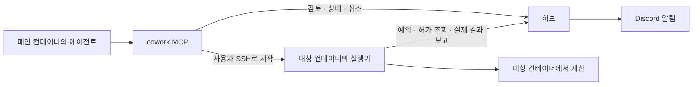

# 메인 컨테이너에서 SSH로 실행

에이전트와 MCP는 메인 컨테이너에 둔다. MCP가 사용자 SSH로 대상 컨테이너의 실행기를 시작하고,
접수 결과를 받으면 SSH 연결을 끝낸다. 대상 실행기가 허브의 허가를 기다리고 실제 명령을 실행·보고한다.
허브는 SSH에 접속하지 않으며 대상에 에이전트·MCP 서버·Docker 관리 소켓이 필요하지 않다.



## 원격 환경 등록

`register_ssh_environment`의 입력 예시:

```json
{
  "target": {
    "host": "203.255.11.229",
    "user": "ezy",
    "port": 11010,
    "node_id": "229",
    "workdir": "/10Gdata/ezy/01_Programs/cowork-mcp"
  }
}
```

허용 서버를 먼저 확인한 후 SSH로 UID/GID·작업 경로·자원을 확인하고 환경을 등록한다.
현재 운영 환경에서는 각 컨테이너가 해당 서버의 모든 GPU에 접근하므로, 새 환경의 GPU 목록은
허브에 등록된 서버 장치 목록을 그대로 사용한다. 대상에서 `nvidia-smi`를 실행하거나 UUID·드라이버·
NVML을 검사하지 않는다. GPU가 없는 서버는 빈 GPU 목록으로 등록한다. 같은 입력으로 재요청하면
기존 인스턴스와 저장된 GPU 목록을 재사용한다.

최초 계정 승인 때 지정한 서버 권한과 UID/GID를 사용한다. 등록 검사를 통과하면
`approved: true`, `requires_approval: false`를 반환하고 환경은 바로 `READY`가 된다.
컨테이너별 관리자 승인은 없다. 물리 서버 대응은 사용자가 선택한 서버를 기준으로 하며,
자동 등록은 호스트의 물리적 신원을 증명하지 않는다.

이전 허브의 승인 대기 환경은 허브 시작 시 현재 계정·서버 권한·UID/GID·자원 한도를 다시
검사해 자동 전환한다. 검사에 실패하거나 `UNAVAILABLE`인 환경을 임의로 활성화하지 않는다.
기존 승인 API는 이전 관리 클라이언트 호환용으로 유지한다.

## 제출과 재시도

기존 `plan_job`과 `submit_job`을 사용하되 `spec.environment_ids`에 선택한 환경 하나를 지정한다.
현재 환경이면 로컬 실행기를, 메인 설정의 `ssh_runners`에 등록된 환경이면 SSH 실행기를 사용한다.
여러 환경을 한 번에 제출하지 않는다. 검토 결과와 사용자 선택으로 한 환경을 정한 뒤 제출한다.

원격 명령은 SSH 명령 문자열에 삽입하지 않는다. 고정된 실행기 모듈을 실행하고 작업 인자 배열을
JSON 표준입력으로 전달한다. 토큰 값은 전송하지 않으며 대상이 공유된 개인 토큰 파일을 읽는다.
기존 SSH 키·알려진 호스트 확인을 사용한다. 비밀번호 입력을 기다리거나 호스트 검증을 해제하지 않는다.

원격 접수 이후 SSH가 종료되어도 작업은 유지된다. 대기열 조회·실제 종료·예약 반환은 기존 실행기와
허브가 처리한다. 취소는 메인 MCP의 `cancel_job`으로 요청하며 별도 SSH 프로세스 종료 명령은 필요 없다.

`SSH_RESULT_UNCERTAIN`이면 원격에서 이미 접수했을 수 있다. 같은 `request_key`와 같은 요청으로 재시도한다.
대상에 저장한 기록을 재사용해 중복 실행을 막는다. 새 키나 일반 SSH 계산 명령으로 우회하지 않는다.

## 현재 전제와 검증 범위

- 메인과 대상에서 프로젝트·Python 실행 파일·개인 토큰·실행기 기록이 **같은 공유 경로**로 보여야 한다.
  이 버전은 파일 복사, Python 설치, 서로 다른 NFS 마운트 경로 변환을 하지 않는다.
- 현재 SSH 세션의 conda 활성화·셸 함수는 전송하지 않는다. 대상에서 유효한 실행 파일 또는 진입 스크립트를 쓴다.
- 229의 `ezy@203.255.11.229:11010`에서 공유 Python과 코드, UID/GID `1101:1100`, GPU 4개를 확인했다.
- 실제 MCP를 통해 환경 `9b207fd398494c479f5b4489a93bc22c`를 등록하고 메인 실행기 설정에 SSH 경로를 연결했다.
  최초 등록 후 관리자 승인을 완료했으며 현재 상태는 `READY`다.
- 자동 시험은 임시 HTTP 허브와 실제 대상 실행기 프로세스를 사용하고 SSH 전송만 시험용으로 대체했다.
  승인 전 실행 차단, 재등록, SSH 응답 유실 후 같은 작업 재사용, 대기·자동 전환·취소·중복 실행 방지를 확인했다.
- 2026-09-19 운영 허브·실제 SSH·새 MCP 연결로 229의 작업 두 건을 실행했다. RTX 3090의 CUDA 장치 선택과
  메모리 접근, 같은 GPU 대기·자동 전환, MCP 종료 후 실행 유지, 동일 요청 재사용과 Discord 전송을 확인했다.
  범위와 상세 결과는 [229 운영 검증 기록](verification-229.md)을 참고한다.

등록 기록은 `.local/verification/ssh-229-registration.json`에 있으며 인증 비밀정보는 포함하지 않는다.

## 224·228 추가 등록

2026-09-19 메인 컨테이너의 새 MCP 연결로 두 환경을 등록하고 SSH 제출 경로를 저장했다.
두 컨테이너 모두 UID/GID `1101:1100`, 공유 Python·코드·개인 토큰 경로, 허브 접근을 확인했다.
GPU UUID는 해당 서버의 기존 허브 장치 목록과 일치한다. 최초 관리자 승인 후 두 환경 모두
`READY`로 확인했으며, 계산 작업은 제출하지 않았다.

| 서버 | SSH | 환경 ID | CPU 예약 예산 | 메모리 예약 예산 | 등록 GPU |
| --- | --- | --- | --- | --- | --- |
| 224 | `ezy@203.255.11.224:11010` | `8207bea698d142d4949d1c14d4a954d5` | 512 | 928376MiB | H100 NVL 4장 |
| 228 | `ezy@203.255.11.228:11019` | `44d60c69a162426ca5bad9012dc66228` | 40 | 1393270MiB | GTX 1080 Ti 1장 |

운영 허브가 실행 중인 호스트에서 `ezy` 계정으로 다음 승인 절차를 완료했다. 기존 환경 승인 도구를
두 번 호출하며, 위 두 환경에만 적용한다. 관리자 자격 증명은 허브 안에서 사용한다.

```sh
bash /10Gdata/ezy/01_Programs/cowork-mcp/.local/approve-ssh-224-228.sh
```

등록 기록은 `.local/verification/20260919T002417206123Z-ssh224-228-registration.json`에 있다.
승인 확인 기록은 `.local/verification/20260919T002938376142Z-ssh224-228-approved.json`에 있다.
새 stdio MCP 연결의 도구 10개, 두 환경의 `READY` 상태와 메인 설정의 SSH 경로를 확인했다.
각 서버에서 CPU 1개·메모리 64MiB·GPU 1장 요청의 `plan_job`이 즉시 배정 가능한 후보를 반환했다.
사전검토만 수행해 예약을 생성하지 않았고, 기존 사용자 Discord 설정도 유지된 것을 확인했다.
이 기록은 SSH 등록 검증이며 실제 연구 계산이나 GPU 메모리 접근 시험을 뜻하지 않는다.
